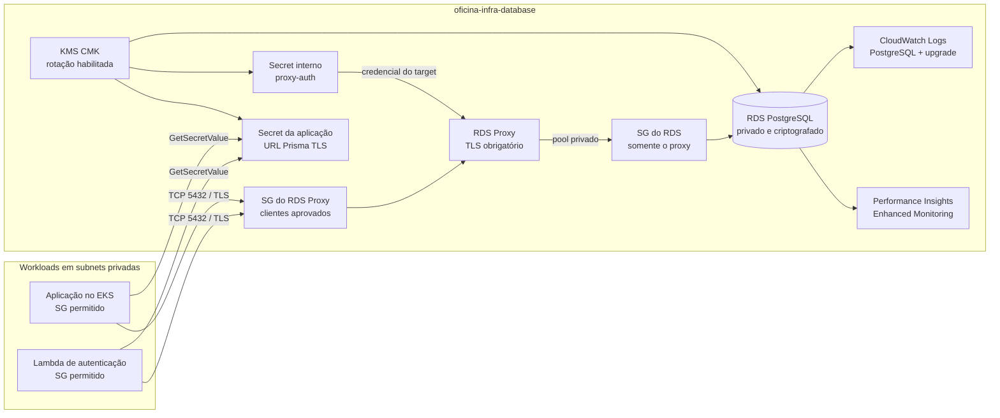

# Oficina - infraestrutura do banco de dados

Repositório Terraform responsável pelo banco PostgreSQL gerenciado da Oficina na AWS. Ele cria uma instância RDS privada, um RDS Proxy obrigatório para as conexões da Lambda/aplicação, criptografia, credenciais geradas, retenção de backups e os recursos operacionais necessários para homologação e produção.

Este é um dos quatro repositórios independentes do Tech Challenge. A rede, as subnets privadas e os security groups dos workloads são entradas produzidas pela infraestrutura Kubernetes; este repositório não cria VPC nem cluster.

## Tecnologias

- Terraform 1.10 ou superior;
- AWS Provider 5.x;
- Amazon RDS for PostgreSQL;
- Amazon RDS Proxy;
- AWS Secrets Manager e AWS KMS;
- CloudWatch Logs, Performance Insights e Enhanced Monitoring;
- GitHub Actions com autenticação AWS por OIDC.

## Arquitetura



Os security groups são separados por função. `allowed_security_group_ids` abre a porta PostgreSQL somente no SG do Proxy; o SG do RDS aceita entrada somente do SG do Proxy, e o Proxy possui egress apenas para o SG do banco na mesma porta. Nenhuma regra por CIDR ou autorreferência é criada.

O endereço Terraform `aws_security_group.database` continua representando o SG já existente do RDS, evitando uma troca de identidade no state. Um novo `aws_security_group.proxy` é criado; revise o primeiro plan para confirmar a atualização do Proxy e das regras antes do apply.

## Recursos provisionados

- DB subnet group com pelo menos duas subnets privadas distintas;
- dois security groups baseados exclusivamente em referências: workloads -> Proxy e Proxy -> RDS;
- chave KMS gerenciada pelo cliente, com rotação anual habilitada;
- senha aleatória de 40 caracteres por padrão;
- dois secrets KMS-encrypted, separados para evitar dependência circular;
- parameter group PostgreSQL com TLS obrigatório, SCRAM-SHA-256 e logging operacional;
- RDS PostgreSQL com storage `gp3`, autoscaling de storage e endpoint não público;
- Multi-AZ configurável e obrigatório quando `environment` é `prod` ou `production`;
- backups automáticos com PITR, janela de manutenção e cópia de tags para snapshots;
- deletion protection e final snapshot obrigatórios em produção;
- Performance Insights criptografado, Enhanced Monitoring e exportação de logs;
- RDS Proxy com TLS obrigatório e pool de conexões configurável;
- IAM roles de mínimo escopo para Enhanced Monitoring e leitura do secret pelo proxy.

## Organização

```text
.
|-- .github/
|   |-- CODEOWNERS
|   |-- settings.yml
|   `-- workflows/
|       |-- ci.yml
|       `-- deploy.yml
|-- backend/
|   |-- homolog.s3.tfbackend.example
|   `-- prod.s3.tfbackend.example
|-- environments/
|   |-- homolog.tfvars.example
|   `-- prod.tfvars.example
|-- backend.tf
|-- iam.tf
|-- kms.tf
|-- locals.tf
|-- logging.tf
|-- network.tf
|-- outputs.tf
|-- providers.tf
|-- proxy.tf
|-- rds.tf
|-- secrets.tf
|-- variables.tf
`-- versions.tf
```

## Pré-requisitos

1. Conta AWS e permissões para RDS, RDS Proxy, EC2 security groups, KMS, Secrets Manager, CloudWatch Logs e IAM;
2. Terraform 1.10 ou superior;
3. bucket S3 de state criado fora deste stack, com versionamento, Block Public Access e criptografia habilitados;
4. VPC existente;
5. ao menos duas subnets privadas em Availability Zones diferentes;
6. security groups existentes da Lambda e/ou workloads do EKS;
7. para CI/CD, um IAM role federado ao OIDC do GitHub.

O backend usa o lockfile nativo do S3 (`use_lockfile = true`) e não precisa de tabela DynamoDB. O role de CI/CD precisa acessar tanto o objeto de state quanto o objeto `<state-key>.tflock`.

## Execução local

Nunca versionar os arquivos reais de backend ou variáveis. Eles são ignorados pelo `.gitignore`.

```bash
cp backend/homolog.s3.tfbackend.example backend/homolog.s3.tfbackend
cp environments/homolog.tfvars.example environments/homolog.tfvars

# Substitua os placeholders antes de executar.
terraform fmt -recursive
terraform init -backend-config=backend/homolog.s3.tfbackend
terraform validate
terraform plan -var-file=environments/homolog.tfvars -out=tfplan
terraform apply tfplan
```

Para produção, use os arquivos `prod`, execute o plan e revise especialmente substituições, alterações de storage, engine e proteção contra exclusão antes do apply.

## Variáveis principais

| Variável | Obrigatória | Descrição |
|---|---:|---|
| `environment` | Sim | `homolog`, `prod` ou outro slug; `prod/production` ativa precondições de segurança. |
| `vpc_id` | Sim | VPC existente dos componentes privados. |
| `private_subnet_ids` | Sim | Duas ou mais subnets privadas em AZs diferentes. |
| `allowed_security_group_ids` | Sim | SGs dos workloads autorizados a acessar somente o RDS Proxy; nenhum CIDR é aceito. |
| `aws_region` | Não | Região AWS; padrão `us-east-1`. |
| `engine_version` | Não | Major/minor do PostgreSQL; padrão `16`. |
| `instance_class` | Não | Classe RDS; padrão `db.t4g.micro`. |
| `allocated_storage` | Não | Storage inicial em GiB; padrão 20. |
| `max_allocated_storage` | Não | Limite do autoscaling de storage; padrão 100. |
| `multi_az` | Não | Standby síncrono em outra AZ; obrigatório em produção. |
| `backup_retention_period` | Não | Retenção PITR de 1 a 35 dias; mínimo 7 em produção. |
| `deletion_protection` | Não | Obrigatório em produção. |
| `skip_final_snapshot` | Não | Deve ser `false` em produção. |
| `performance_insights_retention_period` | Não | 7 ou 731 dias. |
| `monitoring_interval` | Não | Intervalo do Enhanced Monitoring; padrão 60 segundos. |
| `tags` | Não | Tags adicionais mescladas às tags obrigatórias. |

Todas as variáveis, validações e defaults estão documentados em `variables.tf`. Os exemplos de homologação e produção mostram os valores de proteção esperados para cada ambiente.

## Secrets e conexão Prisma

Nenhuma senha é recebida como variável ou armazenada no Git. `random_password` gera a credencial, que é gravada em secrets criptografados pela CMK do stack.

Há dois secrets intencionais:

1. `<project>/<environment>/database/proxy-auth`: contém apenas `username` e `password` e é lido pelo RDS Proxy;
2. `<project>/<environment>/database/connection`: secret entregue à aplicação, criado após o proxy.

O segundo secret possui este contrato JSON:

```json
{
  "username": "<generated-user>",
  "password": "<generated-password>",
  "engine": "postgres",
  "host": "<rds-proxy-host>",
  "port": 5432,
  "dbname": "oficina",
  "url": "postgresql://...@<rds-proxy-host>:5432/oficina?schema=public&sslmode=require"
}
```

- `host` e `url` sempre apontam para o proxy TLS e são os valores normais para Lambda/Prisma;
- campos `direct_host` e `direct_url` não são entregues à aplicação; o endpoint direto continua apenas como output não secreto e não possui ingresso de workloads;
- não exiba `SecretString` em logs, outputs de pipeline ou vídeo;
- o state Terraform contém material sensível por definição. Restrinja o bucket/objeto ao role de deploy, habilite versionamento e use KMS no backend quando disponível.

Risco residual: o único usuário PostgreSQL provisionado por este stack é o master, portanto o secret de conexão ainda carrega essa credencial para a aplicação e para a Lambda de autenticação. Criar apenas um nome de usuário runtime sem executar `CREATE ROLE`/`GRANT` quebraria o deploy; a correção definitiva exige um bootstrap SQL auditável que crie e rotacione um role runtime de privilégio mínimo, mantendo o master somente para migrações.

A role da Lambda precisa de `secretsmanager:GetSecretValue` no output `secret_arn`, `kms:Decrypt` na chave informada por `kms_key_arn`, conectividade às subnets privadas e um dos SGs informados em `allowed_security_group_ids`.

## Outputs

| Output | Uso |
|---|---|
| `db_endpoint` / `db_address` | Endpoint informativo do RDS; o SG do banco bloqueia acesso direto de workloads por padrão. |
| `proxy_endpoint` | Endpoint recomendado para Lambda e aplicação. |
| `secret_arn` / `secret_name` | Secret completo da aplicação. |
| `proxy_auth_secret_arn` / `proxy_auth_secret_name` | Secret interno consumido pelo RDS Proxy. |
| `security_group_id` | Alias compatível de `proxy_security_group_id`. |
| `proxy_security_group_id` | SG do Proxy, acessível pelos SGs declarados em `allowed_security_group_ids`. |
| `database_security_group_id` | SG exclusivo do RDS, acessível somente pelo SG do Proxy. |
| `db_subnet_group_name` | Subnet group privado. |
| `kms_key_arn` | CMK do stack. |

Os outputs não expõem senha nem URL de conexão.

## CI/CD e GitHub Environments

### Pull Requests

`.github/workflows/ci.yml` executa em PRs destinados a `homolog` ou `main`:

1. `terraform fmt -check`;
2. init sem backend e `terraform validate`;
3. autenticação OIDC sem access keys permanentes, somente para PRs do próprio repositório;
4. init do state remoto S3;
5. `terraform plan` usando a configuração do GitHub Environment correspondente à branch de destino.

As permissões globais do workflow são apenas `contents: read`. O job `validate` nunca recebe `id-token: write`; somente o job `plan` recebe essa permissão. Um `if` no nível do job pula o plan de PRs vindos de forks antes de acessar o GitHub Environment ou solicitar OIDC.

PR para `homolog` usa o environment `homolog`; PR para `main` usa `production`. Se `production` exigir aprovação, o plan de produção aguardará o reviewer autorizado.

### Deploy automático

`.github/workflows/deploy.yml` usa o plano salvo no próprio job e aplica automaticamente:

| Branch | GitHub Environment | Ambiente Terraform |
|---|---|---|
| `homolog` | `homolog` | `homolog` |
| `main` | `production` | `production` |

No workflow de deploy, `id-token: write` também fica limitado ao job `deploy`, que é o único que assume a role AWS; não há permissão OIDC global.

Configure required reviewers no GitHub Environment `production`. O workflow também bloqueia qualquer tentativa de mapear `production` para uma branch diferente de `main`, ou `homolog` para uma branch diferente de `homolog`.

### Variáveis de cada GitHub Environment

| Nome | Exemplo/uso |
|---|---|
| `AWS_REGION` | `us-east-1` |
| `AWS_DEPLOY_ROLE_ARN` | ARN do role assumido por OIDC. Não é segredo. |
| `TF_STATE_BUCKET` | Bucket S3 de state. |
| `TF_STATE_KEY` | `oficina/database/homolog/terraform.tfstate` ou `oficina/database/production/terraform.tfstate`. |
| `TF_STATE_KMS_KEY_ARN` | Opcional; CMK previamente criada para o backend. |
| `TFVARS_JSON` | Objeto JSON não secreto com as variáveis daquele ambiente. |

Exemplo mínimo de `TFVARS_JSON` para homologação:

```json
{
  "project_name": "oficina",
  "environment": "homolog",
  "vpc_id": "vpc-0123456789abcdef0",
  "private_subnet_ids": ["subnet-0123456789abcdef0", "subnet-0fedcba9876543210"],
  "allowed_security_group_ids": ["sg-0123456789abcdef0"],
  "multi_az": false,
  "backup_retention_period": 7,
  "deletion_protection": false,
  "skip_final_snapshot": true
}
```

Para `production`, use `environment: "production"`, `multi_az: true`, `deletion_protection: true`, `skip_final_snapshot: false` e retenção de 7 a 35 dias. As demais opções podem ser copiadas de `environments/prod.tfvars.example` em sintaxe JSON.

O trust policy do role OIDC deve limitar `token.actions.githubusercontent.com:sub` a este repositório e aos environments esperados, por exemplo:

```text
repo:<organizacao>/oficina-infra-database:environment:homolog
repo:<organizacao>/oficina-infra-database:environment:production
```

Não configure `AWS_ACCESS_KEY_ID` ou `AWS_SECRET_ACCESS_KEY` no GitHub.

## Proteção de branches

`.github/settings.yml` é compatível com o GitHub Settings App e documenta/aplica:

- `main` e `homolog` protegidas;
- nenhum commit direto, force-push ou exclusão;
- ao menos uma aprovação e revisão de code owner;
- checks `Validate` e `Plan` obrigatórios;
- histórico linear e conversas resolvidas.

O `CODEOWNERS` referencia `@soat-architecture`. O administrador ainda precisa adicionar esse usuário ao repositório com acesso suficiente para que a regra seja válida e instalar/configurar o Settings App, ou reproduzir as regras em GitHub Rulesets.

## Backup, restauração e destruição

- `backup_retention_period > 0` mantém PITR habilitado;
- produção usa 35 dias no exemplo e não apaga backups automáticos junto com a instância;
- snapshots recebem as mesmas tags da instância;
- o identificador do snapshot final possui sufixo aleatório estável, evitando colisão;
- para destruir produção é necessário primeiro aprovar uma mudança que desabilite `deletion_protection`; o snapshot final continua obrigatório;
- a chave KMS possui janela de exclusão, portanto a remoção não é imediata;
- restore/PITR cria uma nova instância e deve ser ensaiado periodicamente; Terraform não automatiza a decisão de failover/restauração neste stack.

## Observabilidade

O módulo habilita Performance Insights, métricas do Enhanced Monitoring e exporta `postgresql`/`upgrade` para CloudWatch Logs. A integração AWS/Datadog deste projeto coleta métricas RDS e RDS Proxy, incluindo CPU, memória livre, storage, conexões, latência e erros.

Os logs continuam retidos no CloudWatch e não são enviados ao Datadog pelo código atual. Essa ingestão exige Datadog Forwarder com subscriptions nos log groups; Enhanced Monitoring também requer a configuração indicada pela integração RDS. Trate isso como evolução explícita e não como evidência da entrega atual.

Não são criadas API keys, Forwarder ou subscriptions Datadog neste repositório.

## Swagger / Postman

Não aplicável: este repositório de infraestrutura não expõe endpoints HTTP. A documentação compartilhada das APIs pertence à [aplicação principal oficina-api](https://github.com/christochula/oficina-api); o link do Swagger implantado deve ser registrado no README da aplicação e na entrega final.

## Custos e limites

RDS, Multi-AZ, RDS Proxy, Performance Insights de longa retenção, logs, snapshots e KMS geram custos. Os exemplos usam uma configuração menor em homologação e proteções corporativas em produção; ajuste classes e retenções após medir carga, sem remover as precondições de segurança de produção.
